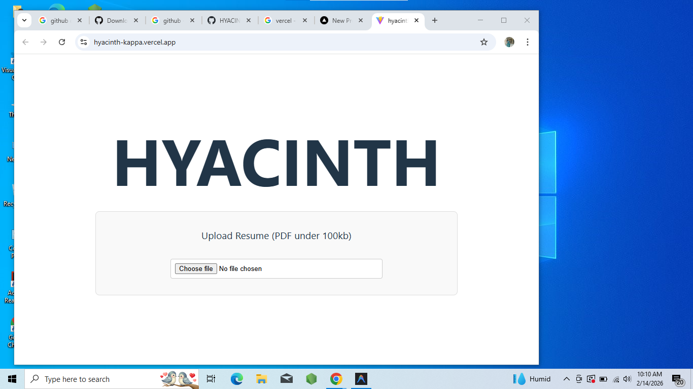

<p align="center">
  
</p>

# HYACINTH 🎯

## Basic Details

- [@vitejs/plugin-react](https://github.com/vitejs/vite-plugin-react/blob/main/packages/plugin-react) uses [Babel](https://babeljs.io/) (or [oxc](https://oxc.rs) when used in [rolldown-vite](https://vite.dev/guide/rolldown)) for Fast Refresh
- [@vitejs/plugin-react-swc](https://github.com/vitejs/vite-plugin-react/blob/main/packages/plugin-react-swc) uses 

### Team Members
- Member 1: Hana Fathima - MAMO College
- Member 2: Malavika - MAMO College

### Hosted Project Link
[mention your project hosted link here]

### Project Description
HYACINTH is an AI-powered resume analyzer that extracts text from PDF resumes and provides intelligent insights to help job seekers improve their profiles. It uses Gemini API to analyze the content against job descriptions.

### The Problem statement
Job seekers often struggle to tailor their resumes for specific roles, and manual review is time-consuming. Applicant Tracking Systems (ATS) can filter out good candidates due to formatting or keyword mismatches.

### The Solution
We provide a tool that parses PDF resumes, extracts text, and uses AI to analyze strengths, weaknesses, and keyword matches, offering actionable feedback to increase the chances of getting shortlisted.

---

## Technical Details

### Technologies/Components Used

**For Software:**
- Languages used: JavaScript
- Frameworks used: React, Vite
- Libraries used: pdfjs-dist
- Tools used: Git, Antigravity, Gemini API


---

## Features

List the key features of your project:
- Feature 1: PDF Resume Upload & Parsing
- Feature 2: AI-Powered Resume Analysis
- Feature 3: Job Role Suitability Check
- Feature 4: Actionable Improvement Suggestions

---

## Implementation

### For Software:

#### Installation
```bash
npm install
```

#### Run
```bash
npm run dev
```


---

## Project Documentation

### For Software:

#### Screenshots (Add at least 3)


*Add caption explaining what this shows*


*Add caption explaining what this shows*


*Add caption explaining what this shows*

#### Diagrams

**System Architecture:**


*Explain your system architecture - components, data flow, tech stack interaction*

**Application Workflow:**


*Add caption explaining your workflow*

---


---


---

## Project Demo

### Video
[Add your demo video link here - YouTube, Google Drive, etc.]

*Explain what the video demonstrates - key features, user flow, technical highlights*

### Additional Demos
[Add any extra demo materials/links - Live site, APK download, online demo, etc.]

---

## AI Tools Used (Optional - For Transparency Bonus)

If you used AI tools during development, document them here for transparency:

**Tool Used:** [e.g., GitHub Copilot, v0.dev, Cursor, ChatGPT, Claude]

**Purpose:** [What you used it for]
- Example: "Generated boilerplate React components"
- Example: "Debugging assistance for async functions"
- Example: "Code review and optimization suggestions"

**Key Prompts Used:**
- "Create a REST API endpoint for user authentication"
- "Debug this async function that's causing race conditions"
- "Optimize this database query for better performance"

**Percentage of AI-generated code:** [Approximately X%]

**Human Contributions:**
- Architecture design and planning
- Custom business logic implementation
- Integration and testing
- UI/UX design decisions

*Note: Proper documentation of AI usage demonstrates transparency and earns bonus points in evaluation!*

---

## Team Contributions

- [Name 1]: [Specific contributions - e.g., Frontend development, API integration, etc.]
- [Name 2]: [Specific contributions - e.g., Backend development, Database design, etc.]
- [Name 3]: [Specific contributions - e.g., UI/UX design, Testing, Documentation, etc.]

---

## License

This project is licensed under the [LICENSE_NAME] License - see the [LICENSE](LICENSE) file for details.

**Common License Options:**
- MIT License (Permissive, widely used)
- Apache 2.0 (Permissive with patent grant)
- GPL v3 (Copyleft, requires derivative works to be open source)

---

Made with ❤️ at TinkerHub
